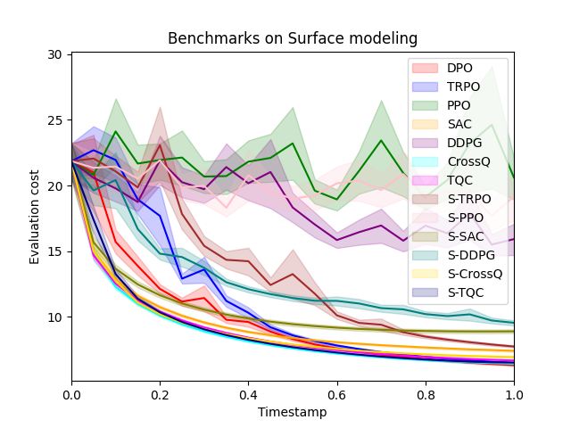
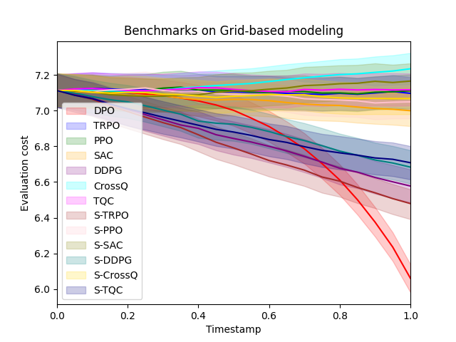
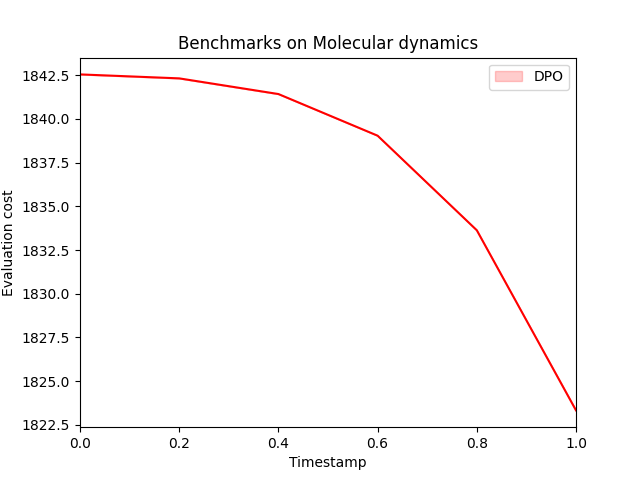

# DPO: Differential Policy Optimization

[](./LICENSE)

## Introduction
- **Differential Policy Optimization (DPO)** introduces a differential formulation of reinforcement learning designed to improve trajectory consistency and sample efficiency in continuous control problems. Unlike conventional RL methods that rely on value-based formulations (Bellman equations, Q/V-functions), our method is based on a **dual, differential perspective** rooted in continuous-time control theory. Standard RL can be viewed as a discrete approximation of a control-theoretic integral formulation, which in turn admits a differential dual. We focus on building a **policy optimization method grounded in this differential dual**, enhanced by a **Hamiltonian prior**.
---

### Key Features

- **Differential RL Framework:** Optimizes local trajectory dynamics directly, bypassing cumulative reward maximization.
- **Pointwise Convergence:** Theoretical convergence guarantees and sample complexity bounds.
- **Physics-Based Learning:** Performs well in tasks realted to scientific computing.

---

## Experiments

For experiments and benchmarkings, we designed tasks to reflect critical challenges in scientific modeling:

1. **Surface Modeling**  
   Optimization over evolving surfaces, where rewards depend on the geometric and physical properties of the surface.

2. **Grid-based Modeling**  
   Control on coarse grids with fine-grid evaluations, representative of multiscale problems with implicit rewards.

3. **Molecular Dynamics**  
   Learning in graph-based atomic systems where dynamics depend on nonlocal interactions and energy-based cost functionals.

## 📦 Setup Instructions
### 1. Clone the repo and install dependencies

```bash
git clone https://github.com/mpnguyen2/dpo.git
cd dpo
pip install -r requirements.txt
```

### 2. Install trained models for benchmarking
Due to size constraints, two folders ```models``` and ```benchmarks/models``` are not in the repo. Download them here:

📥 First download and upzip the file in (https://www.swisstransfer.com/d/fb4868ed-a971-43b8-be05-d5eb0c67d80f). Password to download is: **dpo_assets**. Inside the unzipped folder are two folders ```models``` and ```benchmarks/models```.

Put those files into corresponding directories from the root directory:
```
dpo/
├── models/
├── benchmarks/
│   └── models/
```

## Benchmarking Results
### Sample Size
- ~100,000 steps for Materials and Topological Deformation  
- 5,000 steps for Molecular Dynamics due to expensive evaluations

## 🔁 Reproducing Benchmarks

To reproduce the benchmark performance and episode cost plots, run:

```bash
python benchmarks_run.py
```

Our benchmarking includes 13 algorithms, covering both standard and reward-reshaped variants for comprehensive evaluation.

### Benchmark Summary (mean final evaluation cost)

| Algorithm     | Surface modeling | Grid-based modeling | Molecular dynamics |
|---------------|------------------|----------------------|---------------------|
| DPO           | **6.32**         | **6.06**             | **53.34**           |
| TRPO          | 6.48             | 7.10                 | 1842.28             |
| PPO           | 20.61            | 7.11                 | 1842.31             |
| SAC           | 7.41             | 7.00                 | 1361.31             |
| DDPG          | 15.92            | 6.58                 |**68.20**            |
| CrossQ        | **6.42**         | 7.23                 | 923.90              |
| TQC           | 6.67             | 7.12                 | 76.87               |
| S-TRPO        | 7.74             | **6.48**             | 1842.30             |
| S-PPO         | 19.17            | 7.05                 | 1842.30             |
| S-SAC         | 8.89             | 7.17                 | 126.73              |
| S-DDPG        | 9.54             | 6.68                 | 82.95               |
| S-CrossQ      | 6.93             | 7.07                 | 338.07              |
| S-TQC         | 6.51             | 6.71                 | 231.98              |


### Evaluation costs over time steps across different episodes are shown in:

<div align="center">
  
  
  
</div>


For statistical analysis performance over 10 seeds, you can run:
```bash
python benchmarks_run.py --multiple_seeds=1
```

## File structure
```
dpo/
├── output/                  # Benchmark plots and evaluation costs
├── models/                 <- Download this folder from the given link above
├── benchmark/               # Benchmark code
│   └── models/             <- Download this folder from the given link above
├── *.py                     # Python Source code
├── benchmarks_run.py        # Runs all experiments
└── README.md
└── main.ipynb               # DPO training notebook
└── analysis.ipynb           # Misc analysis notebook (model size, stat analysis)
```
