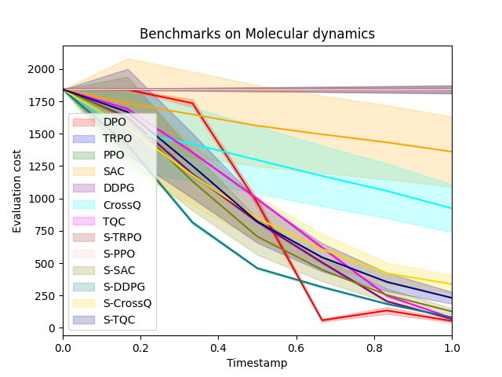

# DPO: Differential Policy Optimization

[](https://arxiv.org/abs/2404.15617)
[](./LICENSE)

## Introduction
- **Differential Policy Optimization (DPO)** introduces a differential formulation of reinforcement learning designed to improve trajectory consistency and sample efficiency in continuous control problems. Unlike conventional RL methods that rely on value-based formulations (Bellman equations, Q/V-functions), our method is based on a **dual, differential perspective** rooted in continuous-time control theory. Standard RL can be viewed as a discrete approximation of a control-theoretic integral formulation, which in turn admits a differential dual. We focus on building a **policy optimization method grounded in this differential dual**, enhanced by a **Hamiltonian prior**.
---

### Key Features

- **Differential RL Framework:** Optimizes local trajectory dynamics directly, bypassing cumulative reward maximization.
- **Pointwise Convergence:** Theoretical convergence guarantees and sample complexity bounds.
- **Physics-Based Learning:** Performs well in tasks with Lagrangian rewards.

---

## Experiments

For experiments and benchmarkings, we designed tasks to reflect critical challenges in scientific modeling:

1. **Material Deformation (Surface Modeling)**  
   Time-evolving surfaces modeled with Bézier curves, optimized under trajectory-dependent cost functionals that capture geometry and physics over time.

2. **Topological Deformation (Grid-based setting)**  
   Control is applied on a coarse grid; cost is evaluated on a fine grid. This multi-scale approach reflects PDE-constrained optimization.

3. **Molecular Dynamics**  
   Atomistic systems represented as graphs; cost is based on nonlocal energy from atomic interactions.

## 📦 Setup Instructions
### 1. Clone the repo and install dependencies

```bash
git clone https://github.com/mpnguyen2/dpo.git
cd dpo
pip install -r requirements.txt
```

### 2. Install trained models for benchmarking
Due to size constraints, two folders ```models``` and ```benchmarks/models``` are not in the repo. Download them here:

📥 Download all files in two folders ```models``` and ```benchmarks/models``` from [Dropbox link](https://www.dropbox.com/scl/fo/n4tuy2jztqbenrh59n21l/AGOdr_YHHEo3pgBF6G39P38?rlkey=g65hut0hi53sodmwozpoidb7k&st=36s6cqca&dl=0)

Put those files into corresponding directories from the root directory:
```
dpo/
├── models/
├── benchmarks/
│   └── models/
```

## Benchmarking Results
### Sample Size
- ~100,000 steps for Materials and Topological Deformation  
- 10,000 steps for Molecular Dynamics due to expensive evaluations

## 🔁 Reproducing Benchmarks

To reproduce the benchmark performance and episode cost plots, run:

```bash
python benchmarks_run.py
```

Our benchmarking includes 15 algorithms, covering both standard and reward-reshaped variants for comprehensive evaluation. If you only need the baseline models — TRPO, PPO, SAC, and their reward-reshaped variants — you can modify ```benchmarks_run.py``` accordingly to skip the additional methods.

### Benchmark Summary (mean final evaluation cost)

| Algorithm     | Materials | Topological | Molecular |
|---------------|-----------|-------------|-----------|
| DPO           | **6.323**     | **6.061**       | **53.340**    |
| TRPO          | 6.503     | 7.230       | 1842.299  |
| PPO           | 19.229    | 7.089       | 1842.296  |
| SAC           | 7.528     | 6.959       | 1369.605  |
| S-TRPO        | 7.709     | **6.502**       | 1842.272  |
| S-PPO         | 15.117    | 7.151       | 1842.316  |
| S-SAC         | 8.686     | 7.267       | 126.449   |
| DDPG          | 15.917    | 6.578       | **68.204**    |
| CrossQ        | **6.414**     | 7.224       | 938.042   |
| TQC           | 6.676     | 7.086       | 76.874    |
| S-DDPG        | 9.543     | 6.684       | 82.946    |
| S-CrossQ      | 6.953     | 7.059       | 331.112   |
| S-TQC         | 6.523     | 6.704       | 236.847   |
| PILCO         | 8.012     | 7.312       | 1759.384  |
| iLQR          | 9.187     | 7.165       | 1843.147  |


### Evaluation costs over time steps across different episodes are shown in:

<div align="center">
  
  
  
</div>

### Memory Usage

Models are lightweight. Example sizes:

| Algorithm | Materials (MB) | Topological (MB) | Molecular (MB) |
|-----------|----------------|------------------|----------------|
| DPO       | 0.17           | 0.66             | 0.17           |
| PPO       | 0.08           | 0.62             | 0.08           |
| SAC       | 0.25           | 2.86             | 0.25           |
| TQC       | 0.57           | 6.45             | 0.57           |
| DDPG      | 4.09           | 5.19             | 4.09           |

## Statistical Analysis on Benchmarking Results

We perform benchmarking using 10 different random seeds, with each seed generating over 200 test episodes.

The table below reports the **mean ± standard deviation** of final evaluation costs across 15 algorithms (and their variants).

| Algorithm     | Materials Deformation     | Topological Deformation     | Molecular Dynamics        |
|---------------|----------------------------|------------------------------|----------------------------|
| **DPO**       | **6.296 ± 0.048**          | **6.046 ± 0.083**            | **53.352 ± 0.055**         |
| TRPO          | 6.468 ± 0.021              | 7.156 ± 0.118                | 1842.302 ± 0.009           |
| PPO           | 19.913 ± 1.172             | 7.157 ± 0.111                | 1842.298 ± 0.012           |
| SAC           | 7.429 ± 0.043              | 7.069 ± 0.091                | 1369.663 ± 12.851          |
| DDPG          | 15.421 ± 1.471             | 6.570 ± 0.082                | **68.203 ± 0.001**         |
| **CrossQ**    | **6.365 ± 0.030**          | 7.212 ± 0.124                | 961.220 ± 14.949           |
| TQC           | 6.591 ± 0.048              | 7.123 ± 0.091                | 76.874 ± 0.001             |
| S-TRPO        | 7.782 ± 0.102              | **6.473 ± 0.093**            | 1842.285 ± 0.014           |
| S-PPO         | 16.995 ± 1.615             | 7.075 ± 0.101                | 1842.298 ± 0.009           |
| S-SAC         | 8.773 ± 0.124              | 7.212 ± 0.122                | 125.930 ± 1.229            |
| S-DDPG        | 9.503 ± 0.210              | 6.642 ± 0.124                | 82.946 ± 0.001             |
| S-CrossQ      | 6.827 ± 0.072              | 7.024 ± 0.113                | 333.757 ± 10.509           |
| S-TQC         | 6.468 ± 0.026              | 6.714 ± 0.096                | 231.981 ± 2.210            |
| PILCO         | 7.932 ± 0.112              | 7.365 ± 0.082                | 1753.437 ± 9.621           |
| iLQR          | 9.105 ± 0.189              | 7.198 ± 0.132                | 1843.120 ± 0.074           |

**DPO** demonstrates **statistically significant** improvements over all baselines in nearly all settings. The only exception is the first experiment (**Material Deformation**), where **DPO** and **CrossQ** exhibit comparable performance. Statistical comparisons are conducted using t-tests on seed-level means.

## File structure
```
dpo/
├── output/                  # Benchmark plots and evaluation costs
├── models/                 <- Download this folder from Dropbox link
├── benchmark/               # Benchmark code
│   └── models/             <- Download this folder from Dropbox link
├── *.py                     # Python Source code
├── benchmarks_run.py        # Runs all experiments
└── README.md
└── main.ipynb               # DPO training notebook
└── analysis.ipynb           # Misc analysis notebook
```

## Citation

If you find this work useful, please cite:

```bibtex
@article{dpo,
  title={DPO: Differential reinforcement learning with application to optimal configuration search},
  author={Chandrajit Bajaj and Minh Nguyen},
  journal={arXiv preprint arXiv:2404.15617},
  year={2024},
  eprint={2404.15617},
  archivePrefix={arXiv},
  primaryClass={cs.LG},
  url={https://arxiv.org/abs/2404.15617}
}
